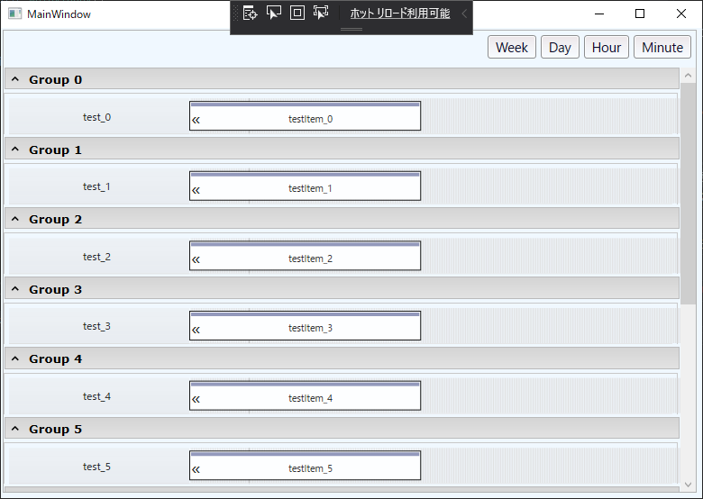

#WPF甘特

WPF甘特图  
Wpf的甘特图控制  

叉子从https://archive.codeplex.com/?p=wpfgantt

##项目说明
一个甘特图，我为我的使用创建。.. 它并不完美，但如果你发现它对你有用，请随时使用它:)  

##查看文档http://wpfgantt.codeplex.com/documentation

注意：是的，有些东西是捷克语，推断和翻译（或问我）并不难。..  
所以，请告诉我，如果这对你有用，如果你要使用它:)  

##屏幕截图

  